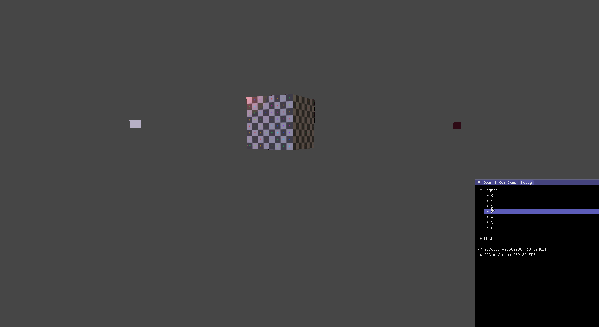

# Win32OpenGL

This is a personal project for me to learn OpenGL and Win32 programming.

## Current features:
- Render 3D scene with different materials/textures
  - Import OBJ/MTL files into scene
- Blinn phong reflection model for lighting
- FPS style controls to fly around scene
- ImGui support to create windows and change values live
## Inputs
- W/A/S/D + Mouse to move around the scene
- ESC to regain mouse control
- Tab to add a new light at the current position

## Build
If you have CMake, you should be able to build the project with `./configure.sh && ./build.sh`.

NOTE: You must currently run the executable from the repo root directory (using `./run.sh` for example) in order to load assets properly.
